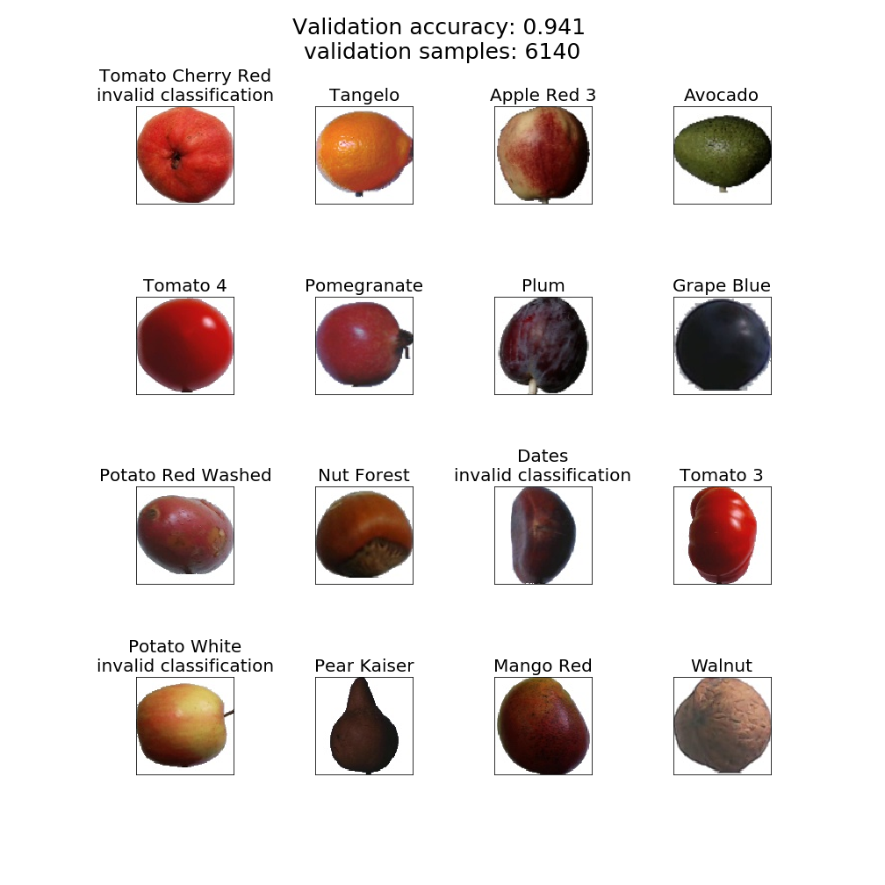
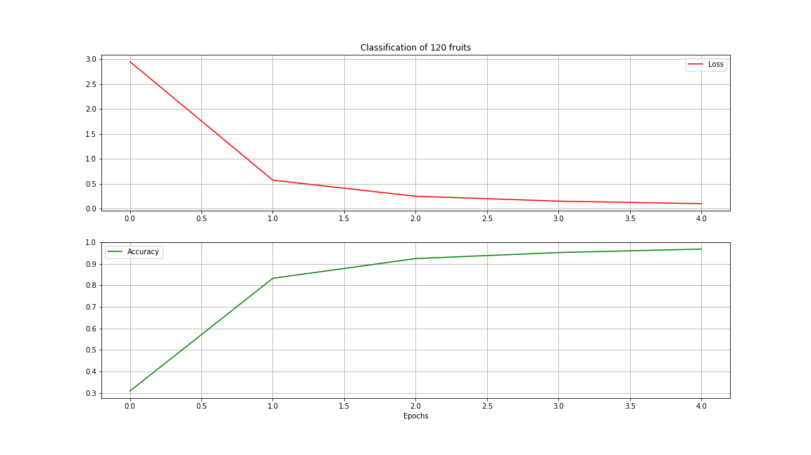
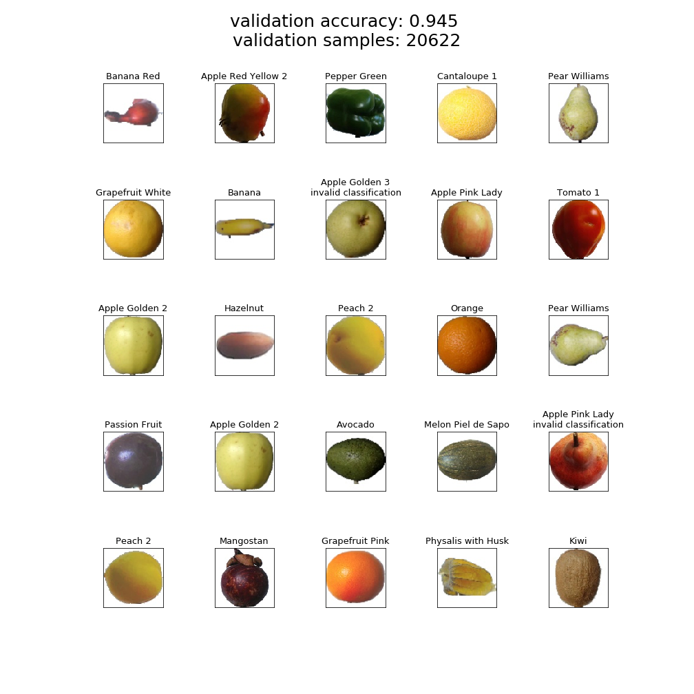
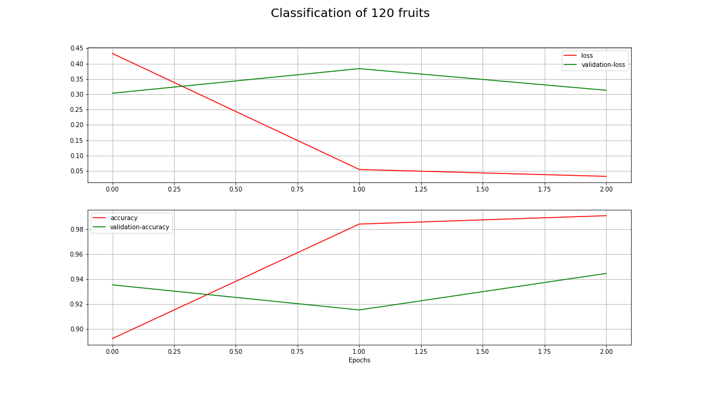

## Description
Using jupyter as work tool to train and run code snippets

Learning model was stopped after 2 consecutive epochs with accuracy at least **98%** on training set.

#### Model
Layers used in model:
1. Convolutional, with 'relu' activation
2. MaxPooling
2. Convolutional, with 'relu' activation
3. MaxPooling
3. Dropout(0.25)
3. Flatten 
3. Dense(64), with 'relu' activation
4. Dense(labels), with 'softmax'

### Problems that occured in learning process
Data set contains around
* 40k training images
* 20k test images

1. Out of memory
  Normalization made on each image consumes more memory, due to conversion of floating point number. It is necessary, without normalization training takes way more time, in my example I trained it for 10 epochs and accuracy was still at 30-40%

#
### Fruits classification - First run

* Using 15% only of training samples
* Using 15% only of test samples

First 25 fruits classified successfully.

#
### Image conversion to float16
Using all images.

#
### Image conversion to float32
Using 70% of dataset

#
### Image conversion to float64
Using only 25% of dataset.

#
#### Dataset used in learning
[Kaggle-Fruits](https://www.kaggle.com/moltean/fruits)
