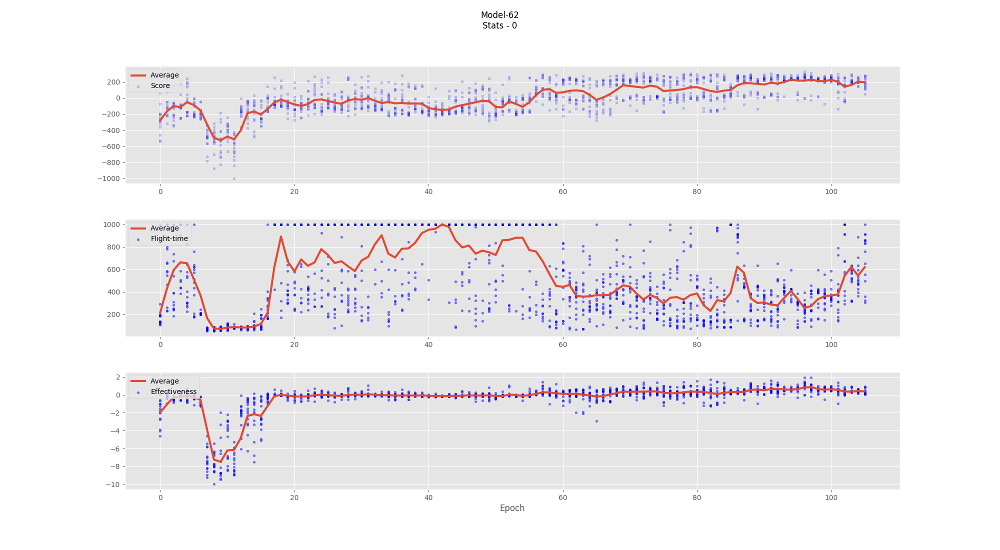
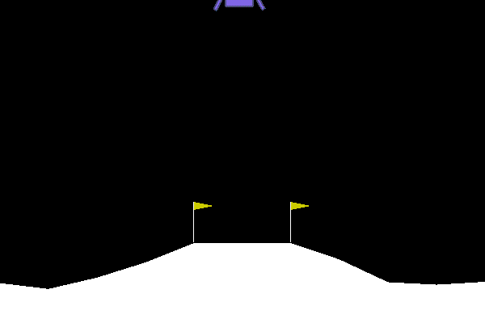
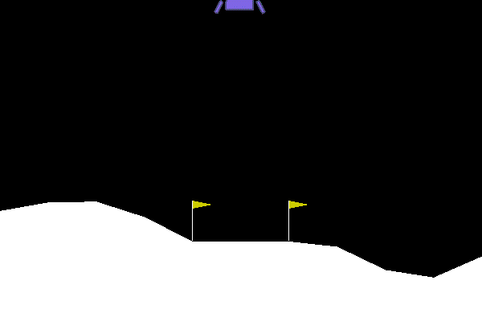
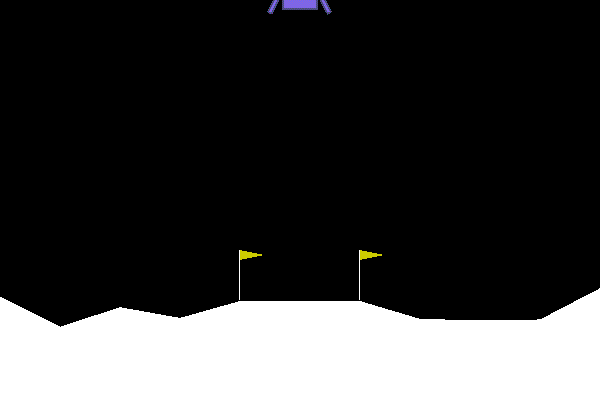

#
## Actor Critic Algorithm with connected nodes

There is no advantage function

This project proves, that we can solve proble with using 2 different models, that models `critic` and `actor` do not share any nodes except `input`.
Disadvantage to this is that both models detects different features from input, but agent model can be smaller.

 

### Log probabilty

### First train

#### A little smoothing

### Landing gifs

##### Game 90
Agent is learning to fly

##### Game 100
Agents is learning to land

##### Game 120
Agent is optimizing trajectory

##### Game 184
Agents is landing smoothly

