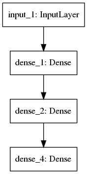
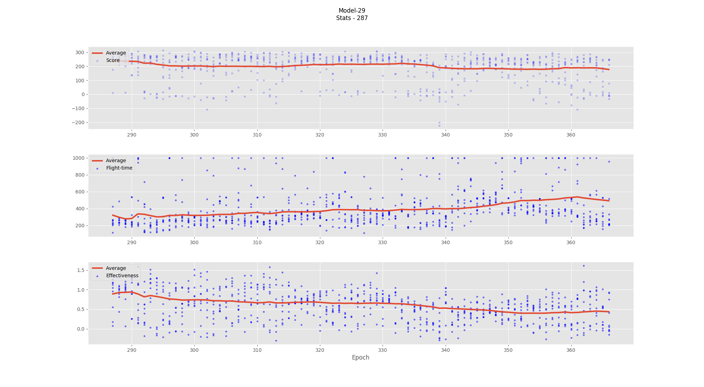

#
## Actor Critic Algorithm with connected nodes

There is no advantage function

Both models, actor and critic, share common nodes `Dense1` and `Dense2`

 

### Last scores

### Landing video

[Youtube](https://youtu.be/IeuL82qYqQk)
    
    
    
#### Tutorial link

[YT: Machine Learning with Phil](https://www.youtube.com/watch?v=2vJtbAha3To)
