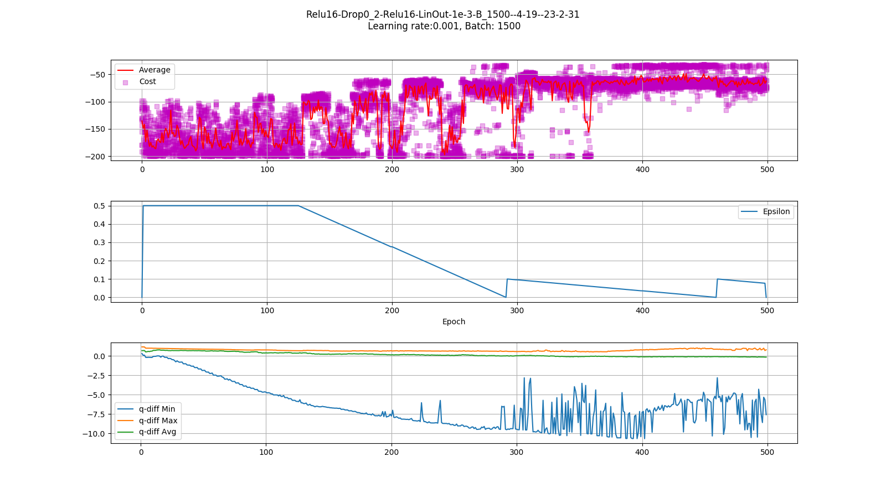
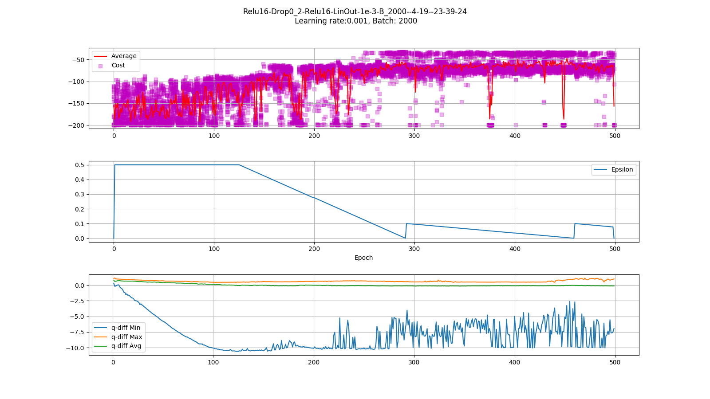
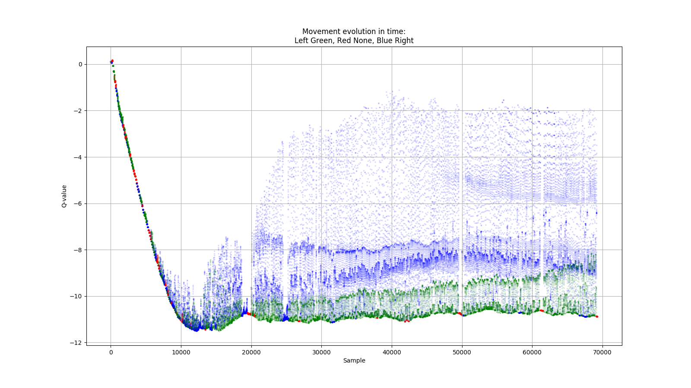

# Deep Q-learning with keras

### First successful training:

Goal was reach around 250 epochs. In training were involved 15 agents. 
Additional reward was granted for high speed movement, `0.2` for small speed and `0.5` for high, sum of both is less than reward for reaching goal.
Main model was updated every `10` trainings.

#
Goal was reach around 200 epochs. In training were involved 20 agents. 
Additional reward was granted for high speed movement, `0.2` for small speed and `0.5` for high, sum of both is less than reward for reaching goal.
Main model was updated every `2` trainings. We can see diffrence if we look at Q-values, there is less `red` moves, which means, agents used to stand less idle and more to choose other actions,

#
As you can see, red periods in model with `minibatch_size=2000` are shorter, due to more frequently model updates.

#### Model 1 - model update every 10 trainings

#### Model 2 - model update every training

Samples comes from training, if action was not random, sample was collected. On graph we see only actions that was chosen in given moment.
As training progress, we can see as red color is disappearing.

#
#### Video of model 2 evolution

